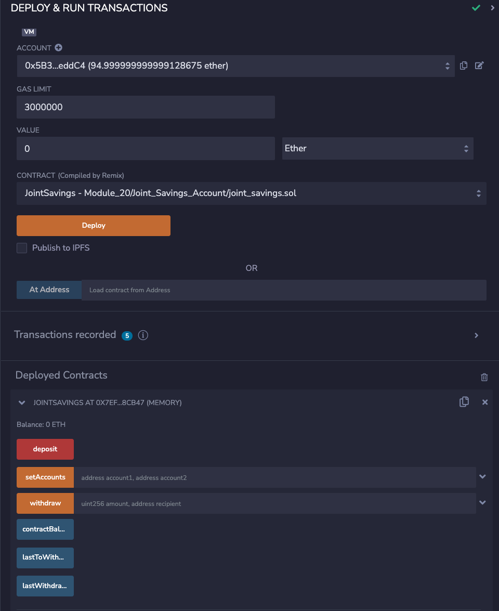
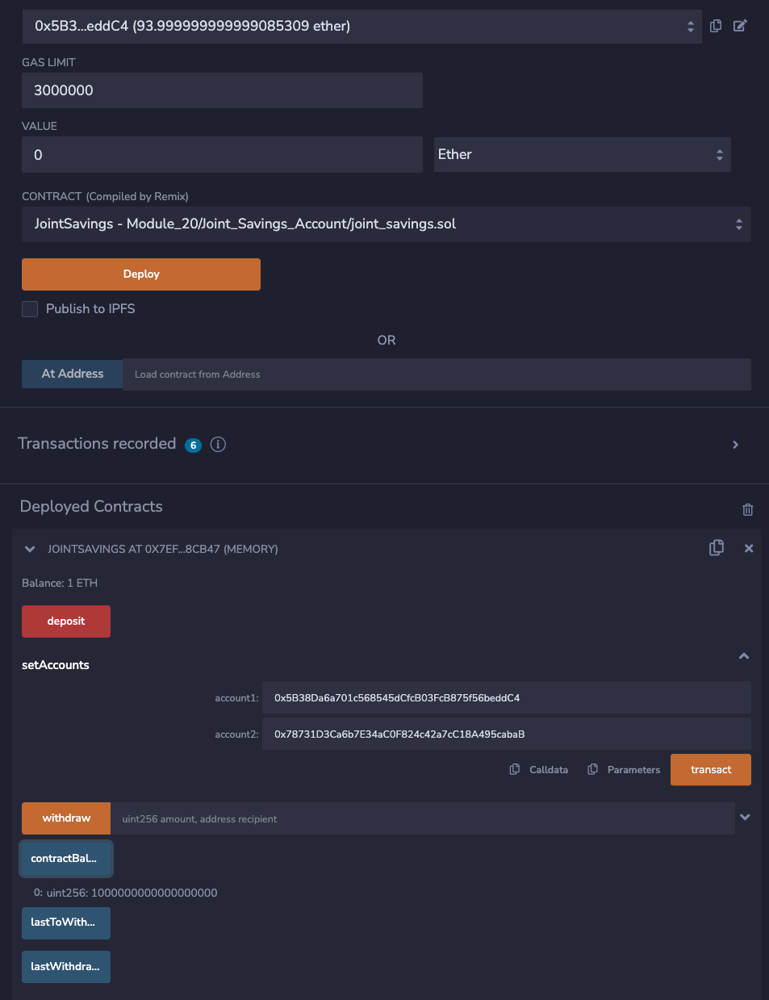
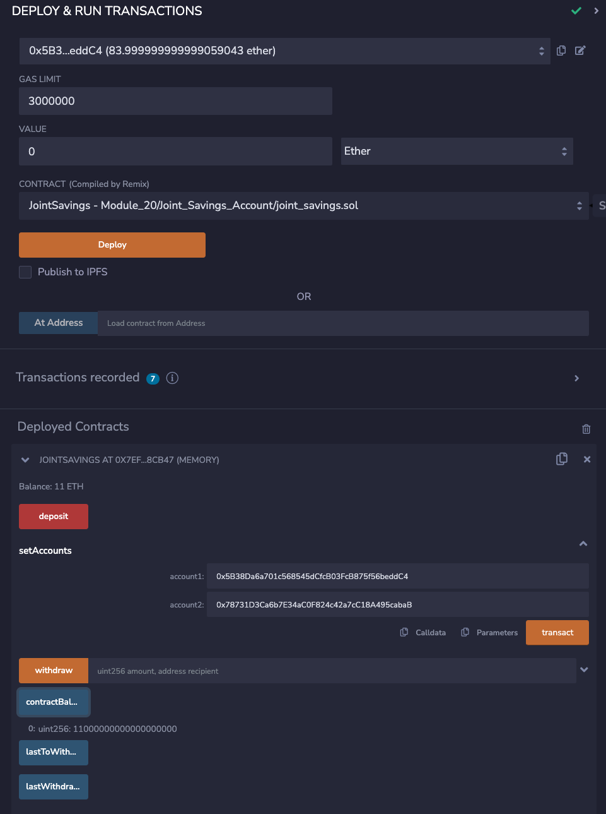
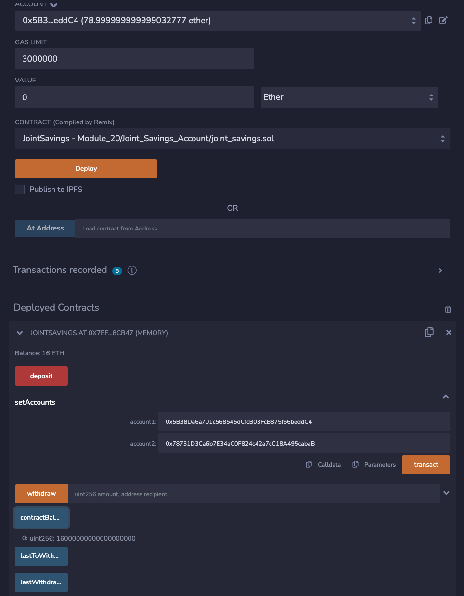
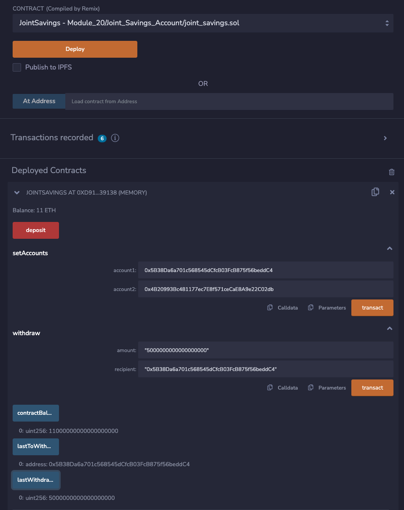
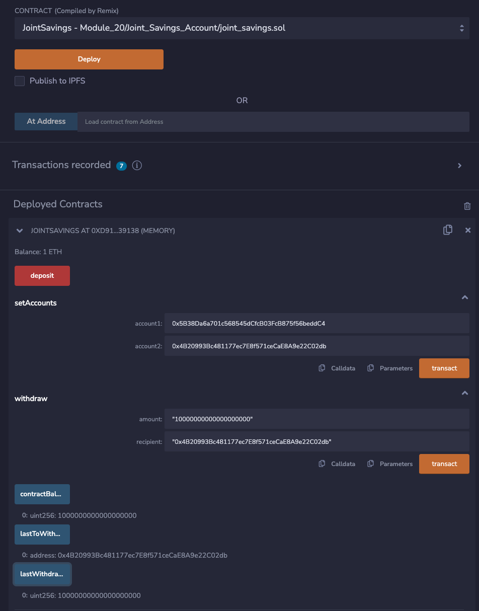

# Module_20_Joint_Savings_Account
## A Solidity smart contract that accepts two user addresses

### Background

The aim of this project was to automate the creation of joint savings accounts by creating a Solidity smart contract that accepts two user addresses. These addresses will be able to control a joint savings account. The smart contract will use ether management functions to implement a financial institution’s requirements for providing the features of the joint savings account. These features will consist of the ability to deposit and withdraw funds from the account.

1.  Compile and Deploy Contract Screenshot

2.  Set up two accounts and deposit 1 Ether

3.  Deposit an additional 10 Ether bringing the balance to 11 Ether

4.  Deposit an additional 5 Ether bringing the balance to 16 Ether

5.  Testing withdrawal function by withdrawing 5 Ether to Account_1. A new balance of 11 Ether confirms correct functionality into Account_1.

6.  Testing withdrawal function by withdrawing 10 Ether to Account_2. A new balance of 1 Ether confirms correct functionality into Account_2.

